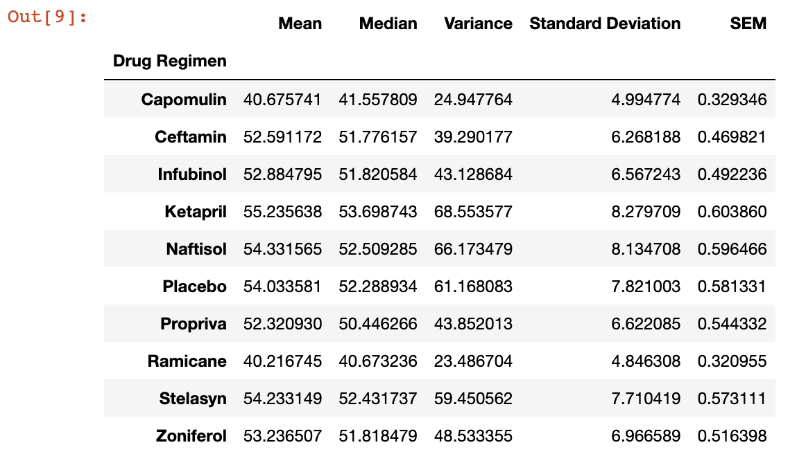
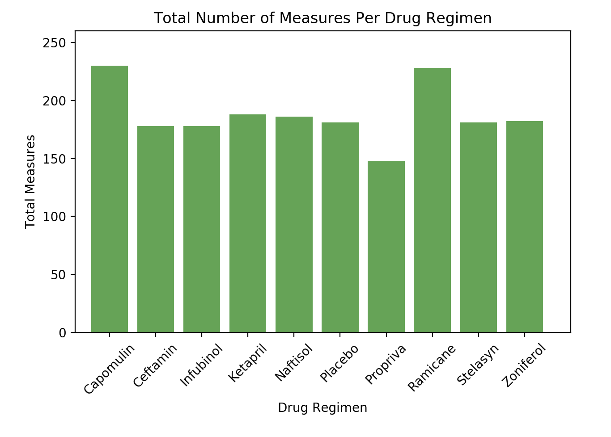
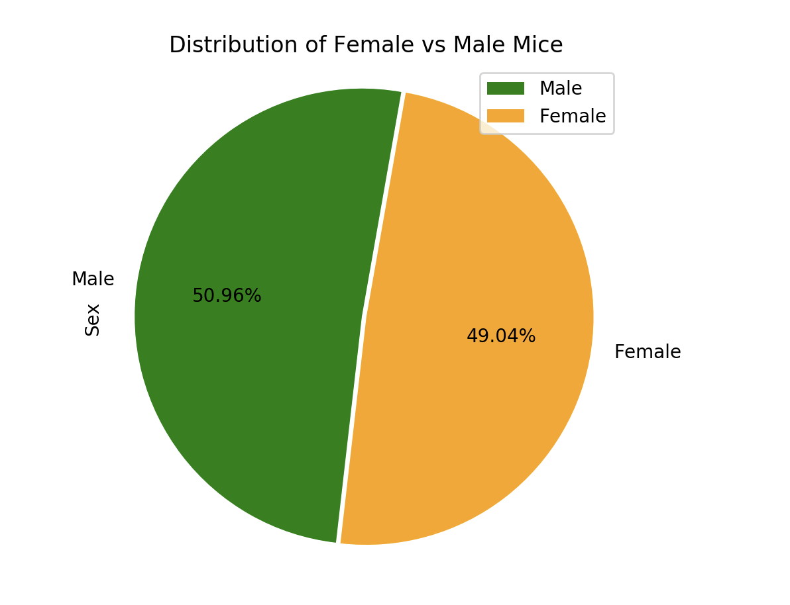
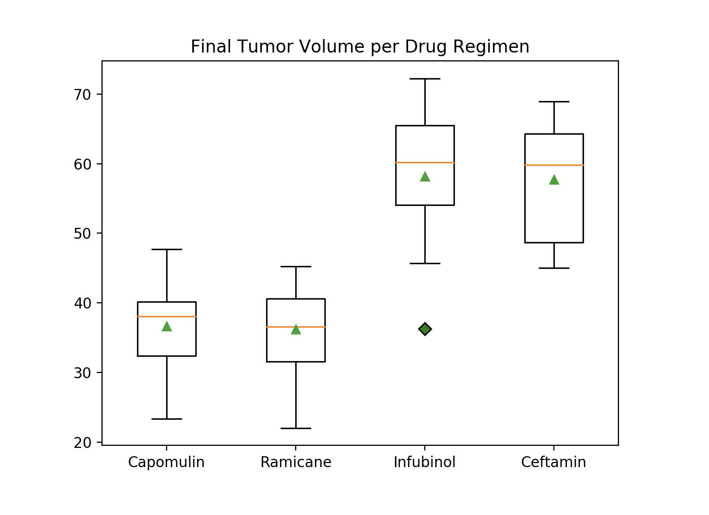

## Summary

In a study of 249 mice identified with squamous cell carcinoma (SCC) tumor, tumor development was observed and measured over a course of 45 days. The study resulted in almost 2000 possibly useful data for analysis in order to compare the performance of the main drug of interested, Capomulin, veersus other treatment regiments. The analysis and plots are a summary of the study results.

## Scope

I utilized Jupyter Notebook, Pandas, and Matplotlib for this analysis. First and foremost, I loaded in the csv [mouse data](Pymaceuticals/data/Mouse_metadata.csv) and the [study results](Pymaceuticals/data/Study_results.csv) and loaded them in as Pandas dataframes. All data for any mouse IDs with duplicate time points were removed in the cleaning process to create the below summary table and plots.

I created a bar plot and pie plot using both Panda's DataFrame.plot() and Matplotlib's pyplot to demonstrate that both of these would generate identical pots.

Then I used Matpllotlib to generate a box and whisker plot for the final tumor volume for the four of the most promising treatment regimens: Capomulin, Ramicane, Infubinol, and Ceftamin.

A single mouse that was treated with Capomulin was then selected to generate further plots, which can be found in the Jupyter Notebook. Observations of the results may also be found at the top of the Jupyter Notebook.
